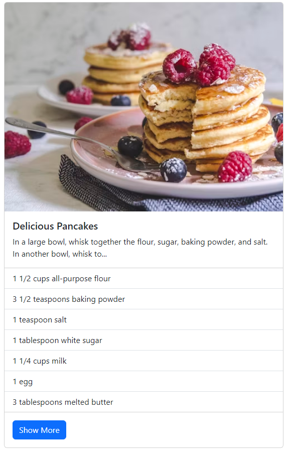
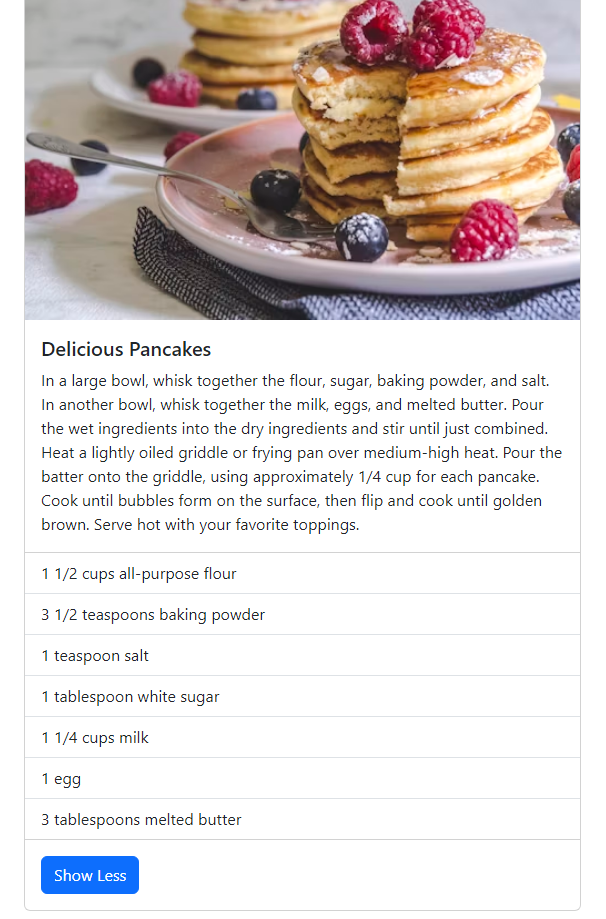

# Objective  
Create a simple, yet elegant recipe webpage utilizing Tailwind CSS for layout and styling. This assignment focuses on building a user-friendly interface with card elements to display recipes, aiming to develop your skills in responsive web design and the integration of CSS frameworks.  
  
# Instructions  
## Setup  
### Project Initialization:  
  
- Initialize your project folder. No specific requirements for using Next.js or any particular framework, allowing you to choose what you're comfortable with.

### Integrate Tailwind CSS:  
  
- Follow the Tailwind CSS installation guide for your chosen project setup.
  
## Development  
### Create Recipe Cards:  
  
- Develop a webpage that displays 6 recipe cards using Tailwind CSS for styling.
- Each card should include:
- A picture from Unsplash related to the food. You can use direct links to Unsplash images.
- A title for the recipe.
- A "View More" button.
  
  
### Layout and Responsiveness:  
  
- Ensure the cards are responsive and adjust gracefully on different screen sizes, utilizing Tailwind CSS's responsive design utilities.
  
  
### Styling with Tailwind CSS:  
  
- Use Tailwind CSS to style your cards and page background. Focus on making the interface as clean and user-friendly as possible.
  
## Optional Enhancements  
  
- Add hover effects to the cards for a more interactive user experience.
- Implement a simple navigation bar at the top of your page using Tailwind CSS.
  
## Submission
  
- Code Repository: Submit a link to your code repository. Ensure your repository is public to allow for review.
- Live Website: Deploy your webpage and provide the URL. This can be done using Netlify.